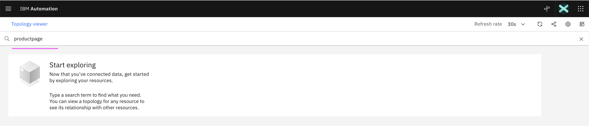
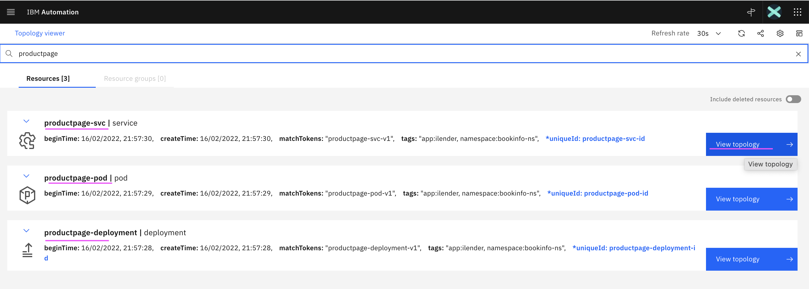
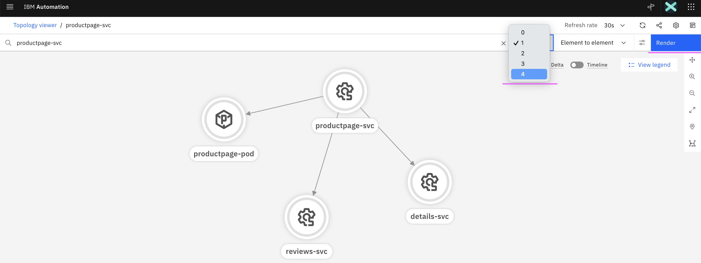
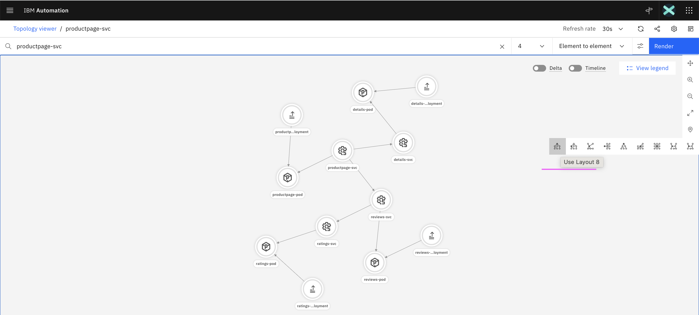
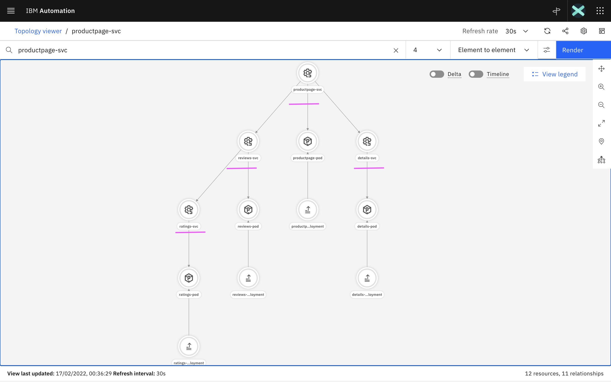
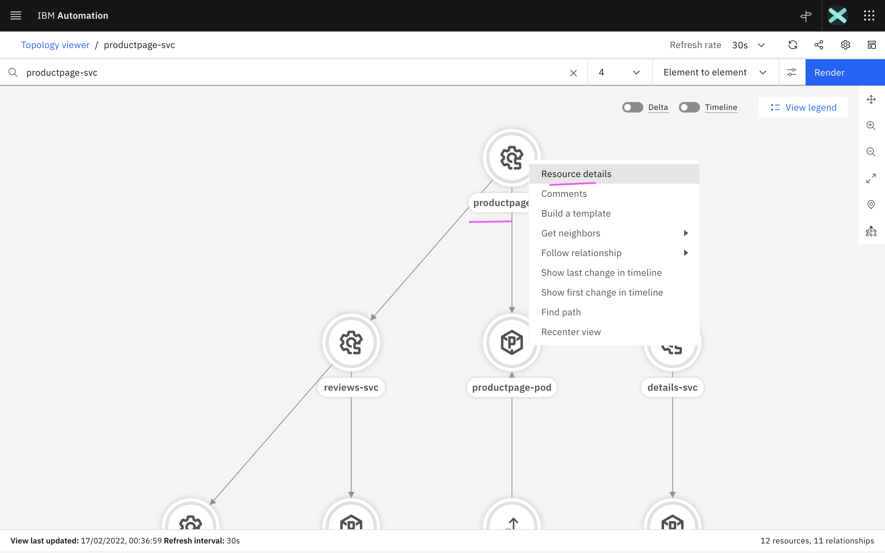
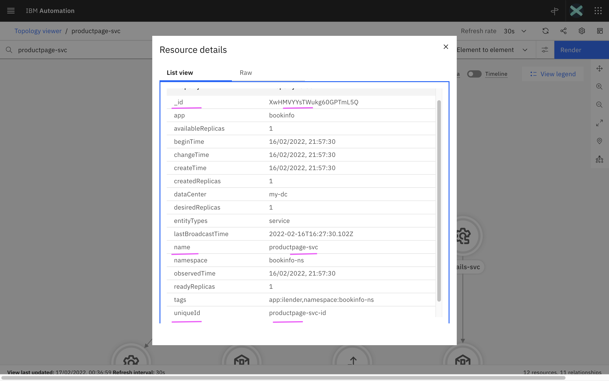

# Create Topology for BookInfo App

This document explains about how to create Topology for BookInfo App using
Topology Manager API.

The shell scripts to create a BookInfo Application topology using Topology API is available in  [files](./files).


## 1. Retrieve Topology API Access Details

#### 1. Login into OCP Cluster

Login into the OCP Cluster where WAIOps AIMgr is installed 
```
oc login ....
```

#### 2. Print the Topology Manager API and access details

Run the below script

```
sh files/00-print-topology-url-usr-pwd.sh
```

As a result, Topology API url and access details will be printed like the below.


```
================================================================
TOPO_API_URL=https://aiops-topology-topology-cp4waiops.aaaa.cloud/1.0/topology
TOPO_API_URL_SWAGGER=https://aiops-topology-topology-cp4waiops.aaaa.cloud/1.0/topology/swagger
TOPO_USER=aiops-topology-cp4waiops-user
TOPO_PWD=aaaaaaaaaaaaaaaa
TOPO_TENENT_ID=cfd95b7e-3bc7-4006-a4a8-a73a79c71255
================================================================
```


## 2. Update Config.sh

Update the below properties in [files/00-config.sh](./files/00-config.sh) based on the Topology API url and access details we retrived in the above section. 

```
TOPO_API_URL=https://aiops-topology-topology-cp4waiops.aaaaaaaaaaaaaaaaaaa.containers.appdomain.cloud/1.0/topology
TOPO_TENENT_ID=cfd95b7e-3bc7-4006-a4a8-a73a79c71255
TOPO_USER=aiops-topology-cp4waiops-user
TOPO_PWD=aaaaaaaaaa
```

## 3. Create Topology

1. Get into the folder `./files` in the cmd line.

2. Run the below 2 files.

```
sh 01-create-topology-entities.sh
sh 02-create-topology-links.sh
```

3. It should have created a bookinfo app topology with the below nodes along with thier links.

- productpage
- details
- reviews
- ratings

## 4. Search and View Topology

1. In the topology viewer, enter `productpage` and press `enter` key.



2. The `productpage` related nodes/resources are displayed as below.

Click on `View topology` in `productpage-svc` node.



3. The `productpage-svc` node and its associated nodes with 1 level are displayed


4. Show all the nodes of the bookinfo by doing below

- Change hop level to `4`
- Click on the `Render` button



5. Change the layout style as below.



6. Now the entire topology bookinfo is displayed with the below style.



7. Show the Node/Resource Details by doing below

- Right click on any Node to get the menu
- Click on the `Resource Details` menu to see its detail



8. The `Resource Details` are displayed here.



9. Here property `_id` is autogenerated.

10. Property `uniqueId` can be provided during the node creation.

## 4. Retrieve `_id` using `uniqueId`

We create node using the `uniqueId`. But for further actions like create link, delete node and etc, it requires `_id`. So we can use API to retrive `_id` using `uniqueId`.

Here is the script to retrive `_id` using `uniqueId`

  [files/03-get-resourceId-by-uniqueId.sh](./files/03-get-resourceId-by-uniqueId.sh)

The output of the above script could be like this.

```
getResourceIdByUniqueId ---> productpage-svc-id ==> XwHMVYYsTWukg60GPTmL5Q
getResourceIdByUniqueId ---> details-svc-id ==> 7wb8y5KmQTi5e5XDcDPPKA
getResourceIdByUniqueId ---> reviews-svc-id ==> xizKZpDlTNmBXUgDeBcN0g
getResourceIdByUniqueId ---> ratings-svc-id ==> LuR8kuOnTSSmZHqVjSdZEA
```

## Note :

1. The article is based on the the following.
- RedHat OpenShift 4.8 on IBM Cloud (ROKS)
- IBM Cloud Pak for Watson AIOps 3.2.0

2. API service is not officially supported for production.
