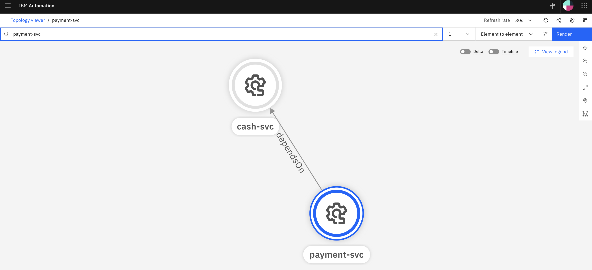
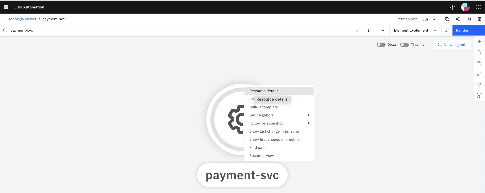
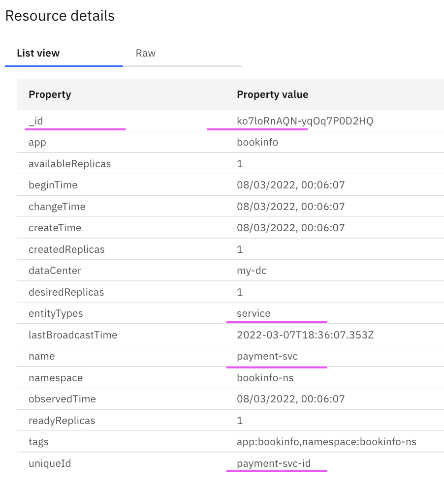
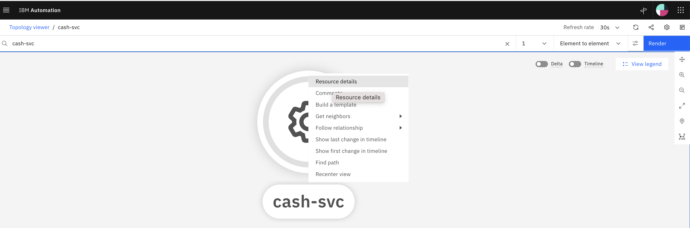
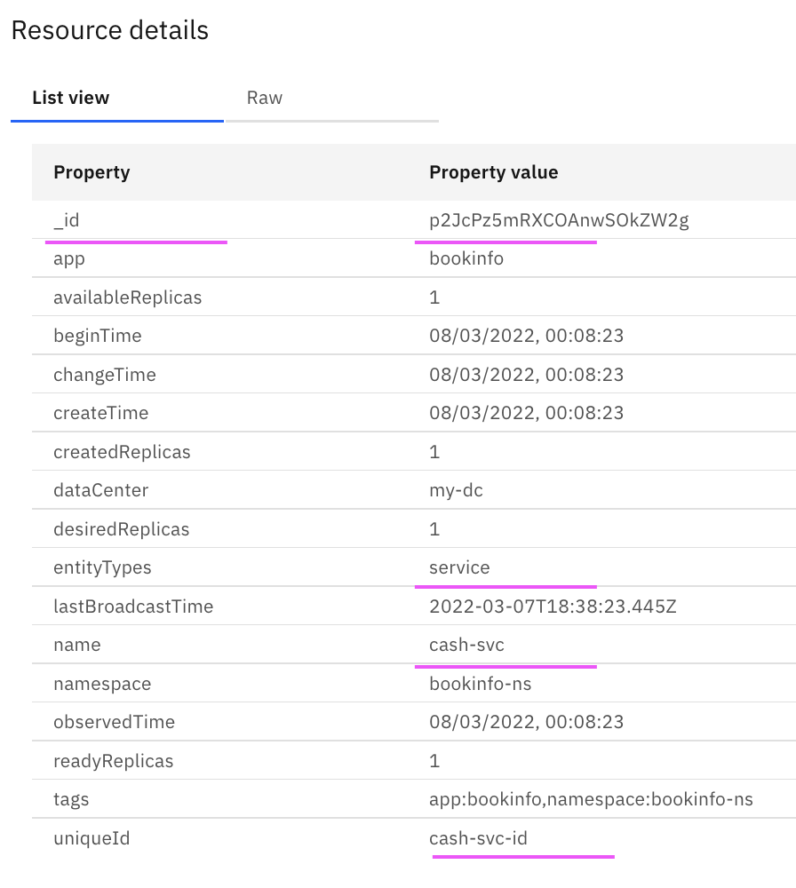

#  Create, Link and Delete topology nodes using API

This document explains about how to create, link and delete topology nodes using Topology Manager API.

Lets us create 2 nodes and create the links between them as like this.



## 1. Retrieve Topology API Access Details

#### 1. Login into OCP Cluster

Login into the OCP Cluster where WAIOps AIMgr is installed 
```
oc login ....
```

#### 2. Print the Topology Manager API and access details

Run the below script

```
sh files/00-print-topology-url-usr-pwd.sh
```

As a result, Topology API url and access details will be printed like the below.


```
================================================================
TOPO_API_URL=https://aiops-topology-topology-cp4waiops.aaaa.cloud/1.0/topology
TOPO_API_URL_SWAGGER=https://aiops-topology-topology-cp4waiops.aaaa.cloud/1.0/topology/swagger
TOPO_USER=aiops-topology-cp4waiops-user
TOPO_PWD=aaaaaaaaaaaaaaaa
TOPO_TENENT_ID=cfd95b7e-3bc7-4006-a4a8-a73a79c71255
================================================================
```

## 2. Update Config File 

Update the below properties in  `./files/00-config.sh` based on the above section. 

```
TOPO_API_URL=https://aiops-topology-topology-cp4waiops.aaaaaaaaaaaaaaaaaaa.containers.appdomain.cloud/1.0/topology
TOPO_TENENT_ID=cfd95b7e-3bc7-4006-a4a8-a73a79c71255
TOPO_USER=aiops-topology-cp4waiops-user
TOPO_PWD=aaaaaaaaaa
```

## 3. Create Nodes

### 3.1 Create Payment Node

1. Get into the folder `./files` in the cmd line.

```
cd files
```

2. Run the below command to create Payment Node.

```
sh 01-create-node-payment.sh
```

3. The content of the file would be like this. Look at the values of all the params. You don't need to change anything here.

```
PARAM_ENTITY_TYPE=service
PARAM_NAME=payment-svc
PARAM_MATCH_TOKEN=payment-svc
PARAM_UNIQUE_ID=payment-svc-id
PARAM_TAG_APP=bookinfo

JSON_DATA=" \"app\": \"$DATA_APP\",\"dataCenter\": \"$TOPO_DATA_CENTER\" , \"entityTypes\": [\"$PARAM_ENTITY_TYPE\"],  \"matchTokens\": [\"$PARAM_MATCH_TOKEN-v1\"],  \"name\": \"$PARAM_NAME\", \"namespace\": \"$DATA_NAMESPACE\", \"uniqueId\": \"$PARAM_UNIQUE_ID\",  \"availableReplicas\": 1,\"createdReplicas\": 1, \"desiredReplicas\": 1, \"readyReplicas\": 1,\"tags\": [\"app:$PARAM_TAG_APP\",\"namespace:$DATA_NAMESPACE\"],\"vertexType\": \"resource\" "

curl -X POST --insecure -u $TOPO_USER:$TOPO_PWD --header 'Content-Type: application/json' --header 'Accept: application/json' --header "X-TenantID: $TOPO_TENENT_ID"  --header "JobId: $JOB_ID" -d "{$JSON_DATA}" "$TOPO_API_URL/resources"

```

4. The below node might have been created. Right on the node to see the Resource Details.



5. Here is the Resource Details. Observe the highlighted fields and Params that we passed. Here `_id` is auto generated.



6. Note down the value of `_id`field.

### 3.2 Create Cash Node

1. Get into the folder `./files` in the cmd line.

```
cd files
```

2. Run the below command to create Cash Node.

```
sh 02-create-node-cash.sh
```

3. The content of the file would be like this. Look at the values of all the params. You don't need to change anything on the JSON_DATA and curl command.

```
PARAM_ENTITY_TYPE=service
PARAM_NAME=cash-svc
PARAM_MATCH_TOKEN=cash-svc
PARAM_UNIQUE_ID=cash-svc-id
PARAM_TAG_APP=bookinfo

JSON_DATA=" \"app\": \"$DATA_APP\",\"dataCenter\": \"$TOPO_DATA_CENTER\" , \"entityTypes\": [\"$PARAM_ENTITY_TYPE\"],  \"matchTokens\": [\"$PARAM_MATCH_TOKEN-v1\"],  \"name\": \"$PARAM_NAME\", \"namespace\": \"$DATA_NAMESPACE\", \"uniqueId\": \"$PARAM_UNIQUE_ID\",  \"availableReplicas\": 1,\"createdReplicas\": 1, \"desiredReplicas\": 1, \"readyReplicas\": 1,\"tags\": [\"app:$PARAM_TAG_APP\",\"namespace:$DATA_NAMESPACE\"],\"vertexType\": \"resource\" "

curl -X POST --insecure -u $TOPO_USER:$TOPO_PWD --header 'Content-Type: application/json' --header 'Accept: application/json' --header "X-TenantID: $TOPO_TENENT_ID"  --header "JobId: $JOB_ID" -d "{$JSON_DATA}" "$TOPO_API_URL/resources"

```

4. The below node might have been created. Right on the node to see the Resource Details.



5. Here is the Resource Details. Observe the highlighted fields and Params that we passed. Here `_id` is auto generated.



6. Note down the value of `_id`field.


## 4. Retrieve Node Id using Unique Id

Though we have already noted the `_id`, we can still retrive it using `uniqueId` using APIs.

### 4.1 Retrieve _id_ of Payment Node

1. Run the below command to retrieve `_id` of Payment Node.

```
sh 03-retrieve-id-by-uniqueid-payment.sh
```

2. The content of the file would be like this. Look at the values of `UNIQUEID`. You don't need to change anything on the curl command.

```
UNIQUEID=payment-svc-id

curl -X GET --insecure -u $TOPO_USER:$TOPO_PWD --header 'Content-Type: application/json' --header 'Accept: application/json' --header "X-TenantID: ${TOPO_TENENT_ID}" -d '{}' "${TOPO_API_URL}/resources?_filter=uniqueId:$UNIQUEID"

```

3. This will print the output like this. Note down the value of `_id`field.

```
{"_executionTime":8,"_offset":0,"_limit":50,"_items":[{"_id":"ko7loRnAQN-yqOq7P0D2HQ"}]}
```

### 4.2 Retrieve _id_ of Cash Node

1. Run the below command to retrieve `_id` of Cash Node.

```
sh 04-retrieve-id-by-uniqueid-cash.sh
```

2. The content of the file would be like this. Look at the values of `UNIQUEID`. You don't need to change anything here.

```
UNIQUEID=cash-svc-id

curl -X GET --insecure -u $TOPO_USER:$TOPO_PWD --header 'Content-Type: application/json' --header 'Accept: application/json' --header "X-TenantID: ${TOPO_TENENT_ID}" -d '{}' "${TOPO_API_URL}/resources?_filter=uniqueId:$UNIQUEID"

```

3. This will print the output like this. Note down the value of `_id`field.

```
{"_executionTime":13,"_offset":0,"_limit":50,"_items":[{"_id":"p2JcPz5mRXCOAnwSOkZW2g"}]}
```

## 5. Create Link 

Create Link between Payment and Cash Node

1. Run the below command to create Payment Node.

```
sh 05-create-link.sh
```

2. The content of the file would be like the below.  

- `FROM_ID` is the `_id` of the Payment Node
- `TO_ID` is the `_id` of the Cash Node

 You don't need to change anything on the curl command.

```
CONNECT_TYPE=dependsOn
FROM_ID=ko7loRnAQN-yqOq7P0D2HQ
TO_ID=p2JcPz5mRXCOAnwSOkZW2g

curl -X POST --insecure -u $TOPO_USER:$TOPO_PWD --header 'Content-Type: application/json' --header 'Accept: application/json' --header "X-TenantID: ${TOPO_TENENT_ID}" -d '{}' "$TOPO_API_URL/resources/$FROM_ID/references/out/$CONNECT_TYPE/$TO_ID"
```

The link might have been created between Payment and Cash Node.

## 6. Delete Link 

Delete the Link between Payment and Cash Node

1. Run the below command to Delete the link.

```
sh 06-delete-link.sh
```

2. The content of the file would be like the below. The Params are same as create link.

```
CONNECT_TYPE=dependsOn
FROM_ID=ko7loRnAQN-yqOq7P0D2HQ
TO_ID=p2JcPz5mRXCOAnwSOkZW2g

curl -X DELETE --insecure -u $TOPO_USER:$TOPO_PWD --header 'Content-Type: application/json' --header 'Accept: application/json' --header "X-TenantID: ${TOPO_TENENT_ID}" -d "{}" "$TOPO_API_URL/resources/$FROM_ID/references/out/$CONNECT_TYPE/$TO_ID"
```

The link might have been deleted between Payment and Cash Node.


## 7. Delete Node 

### 7.1. Delete Payment Node 

1. Run the below command to create Payment Node.

```
sh 07-delete-payment.sh
```

2. The content of the file would be like the below. 

- `ID` is the `_id` of the Payment Node

```
ID=ko7loRnAQN-yqOq7P0D2HQ

curl -X DELETE --insecure -u $TOPO_USER:$TOPO_PWD --header 'Content-Type: application/json' --header 'Accept: application/json' --header "X-TenantID: ${TOPO_TENENT_ID}" -d "{}" "$TOPO_API_URL/resources/$ID"

```

The Payment Node might have been deleted.


### 7.1. Delete Cash Node 

1. Run the below command to delete Cash Node.

```
sh 08-delete-cash.sh
```

2. The content of the file would be like the below. 

- `ID` is the `_id` of the Cash Node

```
ID=p2JcPz5mRXCOAnwSOkZW2g

curl -X DELETE --insecure -u $TOPO_USER:$TOPO_PWD --header 'Content-Type: application/json' --header 'Accept: application/json' --header "X-TenantID: ${TOPO_TENENT_ID}" -d "{}" "$TOPO_API_URL/resources/$ID"

```

The Cash Node might have been deleted.


## Note :

1. The article is based on the the following.
- RedHat OpenShift 4.8 on IBM Cloud (ROKS)
- IBM Cloud Pak for Watson AIOps 3.2.0


2. API service is not officially supported for production.
